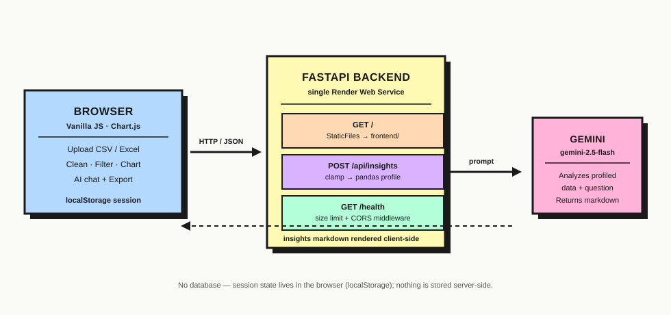

# DataVizard

**A single-service data analysis dashboard — upload a spreadsheet, clean it, chart it, and ask an AI about it, all in the browser.**

[](https://datavizard-your-data-visualisation.onrender.com/)
[](https://github.com/paulmark-05/Data_Visualization_dashboard/actions/workflows/tests.yml)


**[→ Try the live demo](https://datavizard-your-data-visualisation.onrender.com/)** — no signup needed, and there's a *"Try it with sample data"* button on the landing screen so you can see the whole thing working in one click.

<!-- TODO: add a screenshot/GIF of the Visualizations screen here (docs/screenshots/visualizations.png) -->

## Why I built this

I wanted a project that exercised the full loop a data-facing product actually needs — messy real-world input, a defensible cleaning process, honest visualizations, and an AI layer that's grounded in the actual data instead of hallucinating from a prompt alone — while keeping the deployment story dead simple (one FastAPI service, no separate frontend host, no database to provision). Every screen was also deliberately built and re-tested for dark mode, mobile layout, and keyboard/screen-reader accessibility rather than treating those as an afterthought.

## Features

- **Upload CSV or Excel** (multi-sheet `.xlsx` supported with a sheet picker), with duplicate-header handling and currency/percent-formatted numeric parsing (`"$1,200.50"` is recognized as numeric without losing the original display value).
- **Data cleaning** — remove duplicates, fill missing values, strip outliers (IQR method), all logged to an auditable, undoable history.
- **Interactive visualizations** — categorical distributions, numeric histograms, pie charts, a configurable comparison chart (scatter/line/bar), and a hand-rolled correlation heatmap — plus a live filter sidebar (categorical + numeric range) that every chart respects.
- **Chat with your data** — ask Gemini follow-up questions about the dataset in a real back-and-forth thread (not just a single one-shot summary), with suggested starter questions. The backend profiles the data with pandas (row/column counts, dtypes, missing values, describe()) before it ever reaches the model, so answers are grounded in the actual dataset rather than a raw data dump.
- **Exports** — filtered data as CSV or XLSX (with a Summary sheet), a branded multi-page PDF report, a plain-text summary, and the full insights/chat history as JSON.
- **One-click sample dataset** — no need to find your own file to try it.
- **Dark mode**, a fully responsive mobile layout, and keyboard/screen-reader accessible controls throughout (WCAG AA contrast, `aria-label`s, `role="button"` + Enter/Space handling on custom controls).
- **Hardened `/api/insights` endpoint** — request-size limiting (413 on oversized bodies), server-side row/column/cell-length clamping independent of the frontend, and CSV-export formula-injection sanitization (a malicious uploaded cell like `=cmd|'/c calc'!A0` is neutralized on export rather than re-executed when the file is opened in Excel).

## Architecture



FastAPI serves both the REST API **and** the static frontend as one deployable unit — there's no separate frontend host or CORS-across-services problem to manage. There's also no database: a session (dataset + cleaning history + chat history) lives in `localStorage` in the browser, so refreshing the page doesn't lose your place, but nothing about your data is stored server-side.

## Tech stack

| | |
|---|---|
| **Backend** | FastAPI, Pandas, Google Gemini (`google-generativeai`) |
| **Frontend** | Vanilla JS (no framework/build step), Chart.js, jsPDF + autotable, SheetJS |
| **Testing** | pytest, GitHub Actions CI |
| **Deployment** | Render (single Web Service), Docker |

## Running locally

```bash
cd backend
python -m venv venv
source venv/bin/activate  # Windows: venv\Scripts\activate
pip install -r requirements.txt
cp ../.env.example ../.env  # then edit ../.env to set GEMINI_API_KEY
uvicorn main:app --host 0.0.0.0 --port 8000
```

Open http://localhost:8000 — the frontend and API are both served from there.

### Running with Docker

```bash
docker build -t datavizard .
docker run -p 8000:8000 -e GEMINI_API_KEY=your-key-here datavizard
```

### Running tests

```bash
cd backend
pip install -r requirements-dev.txt
pytest tests/ -v
```

## Project layout

```text
DataVizard/
  frontend/
    index.html         # Static UI (neo-brutalist pastel shell)
    style.css           # Theme + layout
    config.js             # Frontend config (API paths, limits)
    app.js                 # Client-side logic (upload, cleaning, charts, AI chat, exports)
    sample-data.csv          # Bundled dataset for the one-click demo
  backend/
    main.py             # FastAPI app: /api/insights (Gemini) + serves frontend/
    requirements.txt
    requirements-dev.txt # + pytest, for CI/local testing
    tests/
      test_main.py       # pytest suite for the API
  docs/
    architecture.svg    # Diagram embedded above
    screenshots/
  .github/workflows/
    tests.yml           # CI: runs pytest on every push/PR to main
  Dockerfile
  .env.example           # Copy to .env and fill GEMINI_API_KEY
```

## Deploying to Render

Single Render **Web Service** pointed at this repo:

- Root Directory: `backend`
- Build Command: `pip install -r requirements.txt`
- Start Command: `uvicorn main:app --host 0.0.0.0 --port $PORT`
- Environment variables: `GEMINI_API_KEY` (required), `GEMINI_MODEL` (optional, defaults to `gemini-2.5-flash`)

Do not commit `.env` — set `GEMINI_API_KEY` in the Render dashboard instead.
